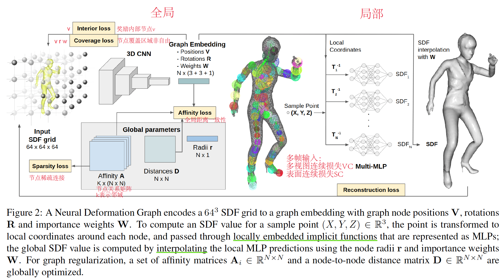
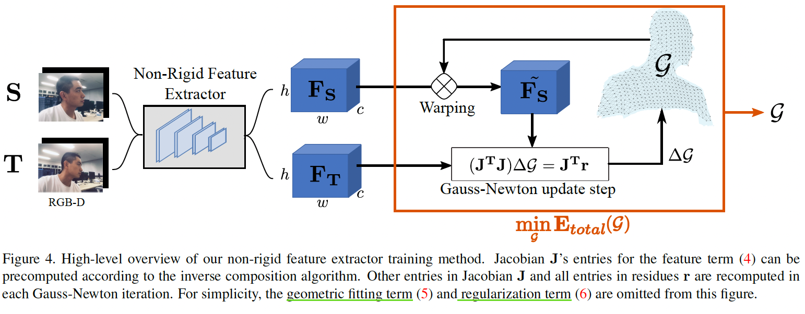

<h1 align="center">Paper Reading Notebooks </h1>

| Field | Paper | Date |
|--|-----|--|
| **CV** - 3D Construction | TransformerFusion |  22-11-08  |
| **CV** - 3D Construction | Neural Deformation Graphs |  22-11-09  |
| **CV** - 3D Construction | Optimize Non-Rigid Tracking |  22-11-10  |
| **Audio** | Whisper |  22-11-17  |

 

# CV - 3D Reconstruction

<h3>TransformerFusion: Monocular RGB Scene Reconstruction using Transformers</h3>

- 【NeurlIPS2021】 [ArXiv](https://arxiv.org/abs/2107.02191)  [Code](https://github.com/AljazBozic/TransformerFusion)
- 简介：Transformer在单RGB Video室内场景三维重建中的应用
- 关键技术：
  1. Coarse-to-fine融合：coarse重建全局场景，fine只重建接近表面处的精细特征，最后将特征融合解码为更高分辨率场景。
  2. 多视图特征融合：每次最多使用K张图片训练，加载超过K张图片时去除attention权值最小的图片，一直保持使用K张图片； 
- Limitation: 遮挡、不完全场景、透明物体重建鲁棒性差。未来研究方向可以使用自监督损失，通过稀疏卷积和局部几何先验获得更高分辨率的几何保真。
  

  

 

---
<h3>Neural Deformation Graphs for Globally-consistent Non-rigid Reconstruction</h3>

- 【CVPR2021】[Paper](https://aljazbozic.github.io/neural_deformation_graphs/) [Code](https://github.com/AljazBozic/NeuralGraph)
- 简介：使用GNN进行非刚性4D重建
- 关键技术：
  1. 全局+局部优化，损失分别计算；全局优化所有帧变形图，局部多MLP表示框
  2. 使用单帧图像多视图一致+变形表面一致来计算循迹和变形
- Limitation: 输入特定为64^3的SDF网格；纹理特征不鲁棒；未来可开展稀疏3D卷积和其他特征如颜色重建损失计算工作。

  

 

---
<h3>Learning to Optimize Non-Rigid Tracking</h3>

- 【CVPR2020】[ArXiv](https://arxiv.org/abs/2003.12230)
- 简介：RGBD非刚性循迹图网络的收敛优化
- 关键技术：
  1. 使用CNN端到端学习深度特征匹配，使得高斯牛顿求解器可以解决大非刚性变形场景
  2. ConditionNet预处理求解器，增加PCG求解速度
- Limitation：3D场景遮挡问题建议直接从3D数据中提取特征；场景流真实数据难获取，建议在合成数据集上学习
- Trick：数据增强；深度图滤波预处理

  

 

---

# Audio

<h3>Robust Speech Recognition via Large-ScaleWeak Supervision</h3>

- OpenAI [Arxiv](https://cdn.openai.com/papers/whisper.pdf)
- 简介：基于Transformer通过大尺度弱监督学习自动语音识别（ASR，Automatic Speech Recognition）模型，模型可以不微调直接进行zero-shot迁移。
- 关键技术：
  1. 数据预处理：从网络上收集了68万小时的多语言（98 种语言）和多任务（multitask）监督数据对Whisper进行了训练。
               预处理使用了三种自动过滤方法：检测并删除机器生成的转录；使用语音检测器确保语言和转录匹配；识别并删除低质量数据。
  2. 模型：基于encoder-decoder的Transformer架构，其中解码器通过训练不同特殊的token识别单个任务，以此实现多任务统一训练。
- Limitation：由于使用现成的Transfomer架构并没有进行过多改进，会出现错误结果。可以对现有模型的解码策略、微调、正则化、数据增强、数据多样性、增加预训练等进行改进。
- 参考：[沐神论文精读](https://www.bilibili.com/video/BV1VG4y1t74x/?spm_id_from=333.999.list.card_archive.click&vd_source=486265fa677326a8f53894f05277bfb9)
       [知乎](https://zhuanlan.zhihu.com/p/568173245)

  

 

---
