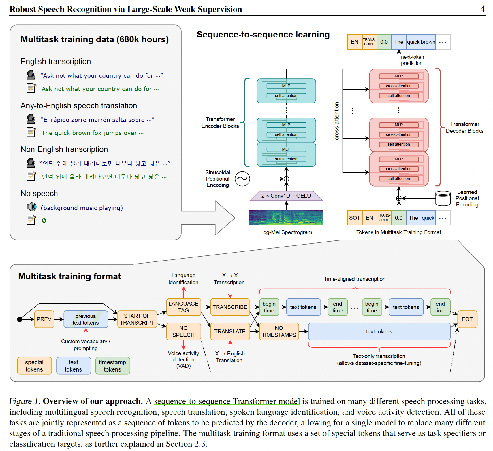

<h1 align="center">Paper Reading Notebooks </h1>

<table>
	<tr>
	    <th>Filed</th>
	    <th>Paper</th>
	    <th>Date</th>  
	</tr >
    <tr >
	    <td rowspan="2"><b>CV</b>: Image</td>
	    <td>VTs-Drloc</td>
	    <td>22-11-24</td>
	</tr>
	<tr>
	    <td>SPT_LSA_ViT</td>
	    <td>22-11-25</td>
	</tr>
	<tr >
	    <td rowspan="7"><b>CV</b>: 3D Construction</td>
	    <td>TransformerFusion</td>
	    <td>22-11-08</td>
	</tr>
	<tr>
	    <td>Neural Deformation Graphs</td>
	    <td>22-11-09</td>
	</tr>
	<tr>
	    <td>Optimize Non-Rigid Tracking</td>
	    <td>22-11-10</td>
	</tr>
	<tr>
	    <td>Neural-DynamicReconstruction (NDR)</td>
	    <td>23-02-14</td>
	</tr>
	<tr>
	    <td>Mono-STAR</td>
	    <td>23-02-17</td>
	</tr>
	<tr>
	    <td>FlowNet3D</td>
	    <td>23-03-09</td>
	</tr>
	<tr>
	    <td>Bi-PointFlowNet</td>
	    <td>23-03-21</td>
	</tr>
    <tr>
        <td rowspan="3"><b>NLP</b></td>
	    <td>HELM</td>
	    <td>23-02-06</td>
	</tr>
    <tr>
	    <td>InstructGPT, Anthropic_LLM</td>
	    <td>23-03-12</td>
	</tr>
    <tr>
	    <td>Visual ChatGPT</td>
	    <td>23-03-17</td>
	</tr>
	<tr>
        <td rowspan="1"><b>NLP</b>: Retrieval</td>
	    <td>Neural Corpus Indexer</td>
	    <td>22-12-21</td>
	</tr>
	<tr>
	    <td rowspan="1"><b>NLP</b>: Audio</td>
	    <td>Whisper</td>
	    <td>22-11-17</td>
	</tr>
</table>

# CV - Image

<h3>Efficient Training of Visual Transformers with Small-Size Datasets</h3>

- 【NeurlIPS2021】 [ArXiv](https://arxiv.org/abs/2106.03746)  [Code](https://github.com/yhlleo/VTs-Drloc)
- 简介：使用小数据集优化训练Visual Transformer，训练加速，泛化能力增强。
- 关键技术：
  1. 验证实验SOTA VTs(CvT、Swin、T2T)在小数据集上效果不好
  2. VT由于缺少卷积归纳偏置，设计自监督代理任务，从图片中提取额外的信息学习空间关联，增加dense relative localization loss($L_{drloc}$)，即插即用。
- Limitation：fine-grained嵌入网格效果不好

  

 

---
<h3>Vision Transformer for Small-Size Datasets</h3>

- 【2021】 [ArXiv](https://arxiv.org/abs/2112.13492)  [Code](https://github.com/aanna0701/SPT_LSA_ViT)
- 简介：使用SPT+LSA解决由于Vision Transformer缺少局部归纳偏置不能在小数据集上训练的问题
- 关键技术：
  1. Shifted Patch Tokenization：利用邻接像素空间关系，扩大感受野
  2. Locality Self-Attention Mechanism：使用Diagonal Masking增加不同token之间的注意力分数 + 通过Learnable Temperature Scaling控制输出分布的平滑度
  

  

 

# CV - 3D Reconstruction

<h3>TransformerFusion: Monocular RGB Scene Reconstruction using Transformers</h3>

- 【NeurlIPS2021】 [ArXiv](https://arxiv.org/abs/2107.02191)  [Code](https://github.com/AljazBozic/TransformerFusion)
- 简介：Transformer在单RGB Video室内场景三维重建中的应用
- 关键技术：
  1. Coarse-to-fine融合：coarse重建全局场景，fine只重建接近表面处的精细特征，最后将特征融合解码为更高分辨率场景。
  2. 多视图特征融合：每次最多使用K张图片训练，加载超过K张图片时去除attention权值最小的图片，一直保持使用K张图片； 
- Limitation: 遮挡、不完全场景、透明物体重建鲁棒性差。未来研究方向可以使用自监督损失，通过稀疏卷积和局部几何先验获得更高分辨率的几何保真。
  

  

 

---
<h3>Neural Deformation Graphs for Globally-consistent Non-rigid Reconstruction</h3>

- 【CVPR2021】[Paper](https://aljazbozic.github.io/neural_deformation_graphs/) [Code](https://github.com/AljazBozic/NeuralGraph)
- 简介：使用GNN进行非刚性4D重建
- 关键技术：
  1. 全局+局部优化，损失分别计算；全局优化所有帧变形图，局部多MLP表示框
  2. 使用单帧图像多视图一致+变形表面一致来计算循迹和变形
- Limitation: 输入特定为64^3的SDF网格；纹理特征不鲁棒；未来可开展稀疏3D卷积和其他特征如颜色重建损失计算工作。

  

 

---
<h3>Learning to Optimize Non-Rigid Tracking</h3>

- 【CVPR2020】[ArXiv](https://arxiv.org/abs/2003.12230)
- 简介：RGBD非刚性循迹图网络的收敛优化
- 关键技术：
  1. 使用CNN端到端学习深度特征匹配，使得高斯牛顿求解器可以解决大非刚性变形场景
  2. ConditionNet预处理求解器，增加PCG求解速度
- Limitation：3D场景遮挡问题建议直接从3D数据中提取特征；场景流真实数据难获取，建议在合成数据集上学习
- Trick：数据增强；深度图滤波预处理

  

 

---
<h3>Neural Surface Reconstruction of Dynamic Scenes with Monocular RGB-D Camera</h3>

- 【NeurlIPS2021】[ArXiv](https://arxiv.org/abs/2206.15258)
- 简介：用单RGBD图像对动态场景进行神经表面重建
- 关键技术：
  1. NDR通过无模板先验的隐式形变场恢复运动信息并将观测帧的采样点变换到基准空间，
再通过基准空间中的符号距离场和神经辐射场分别恢复几何与颜色信息。
  2. 为了保证运动信息的周期一致性，在形变场中设计了一个符合非刚性运动的双射模块；
引入拓扑感知网络解决动态场景中常见的拓扑变化问题
- Limitation：输入是大而快的动作时重建效果不好，很难获得合理的相机位姿作为初始化；建模效率不高

  

 

---
<h3>Mono-STAR: Mono-camera Scene-level Tracking and Reconstruction</h3>

- 【ICRA2023】[ArXiv](https://arxiv.org/abs/2301.13244) [Code](https://github.com/changhaonan/Mono-STAR-demo)
- 简介：RGBD图像同步重建和循迹，支持语义融合、快速动作循迹、非刚性目标变形和拓扑改变
- 关键技术：
  1. 基于光流法进行2D约束解决快速循迹问题
  2. 使用语义感知的变形图SAD-graph处理拓扑改变：变形图的不同边使用变化的自适应权重（自适应正则化损失）
- Limitation：依赖光流法循迹；重建表面不完整且表面难以保持光滑

  

 

---
<h3>FlowNet3D: Learning Scene Flow in 3D Point Clouds</h3>

- 【CVPR2019】[ArXiv](https://arxiv.org/abs/1806.01411) [Code](https://github.com/xingyul/flownet3d)
- 简介：通过深度混合架构直接对点云进行端到端的场景流估计
- 关键技术：
  1. 提出一种端到端的估计连续点云对的场景流方法，做了充分的对比实验、消融、可视化、应用分析验证方法的优越性。
  2. 模型中的flow embedding层学习两片点云的相关特征，set upconv层学习点云到点云的传播特征。（这俩层结构差不多但输入不同学习的特征不同）
- 思考：模型是UNet架构和PointNet++的abstraction layer的合体，并没有特别的创新。论文好在模型应用迁移、实验充分和会讲故事，尤其是场景流的meta-architecture总结的很好。

  

 

---
<h3>Bi-PointFlowNet: Bidirectional Learning for Point Cloud Based Scene Flow Estimation</h3>

- 【ECCV2022】[ArXiv](https://arxiv.org/abs/2207.07522) [Code](https://github.com/cwc1260/BiFlow)

  

 

---
# NLP

<h3>Holistic Evaluation of Language Models</h3>
- [ArXiv](https://arxiv.org/abs/2211.09110)
- 简介：全面的语言模型评测，针对现有语言模型的评测内容包括：核心场景、通用评价标准、针对性评估、模型、适用性等（要有钱有人力有人脉）
- 关键技术：
  1. 先对语言模型分类，补充标准语言模型对各类模型的评价（准确率、校准、鲁棒性、公平性、偏见、有毒性、效率）
  2. 实验发现：InstructGPT davinci v2(175B*)综合表现最好；未开源的模型效果比开源模型效果好得多；所有模型对Prompting有很大的敏感性；模型越大效果越好
- Limitation：场景、评价标准、适用性不全等
- 参考：[沐神论文精读](https://www.bilibili.com/video/BV1z24y1B7uX/?spm_id_from=444.41.list.card_archive.click&vd_source=486265fa677326a8f53894f05277bfb9)

  

 

---
<h3>Training language models to follow instructions with human feedback</h3>
- [ArXiv](https://arxiv.org/abs/2203.02155)
- 参考：[沐神论文精读](https://www.bilibili.com/video/BV1hd4y187CR/?spm_id_from=333.999.0.0&vd_source=486265fa677326a8f53894f05277bfb9)

  
  

 

<h3>Training a Helpful and Harmless Assistant with Reinforcement Learning from Human Feedback</h3>
- [ArXiv](https://arxiv.org/abs/2204.05862)
- 参考：[沐神论文精读](https://www.bilibili.com/video/BV1XY411B7nM/?spm_id_from=333.788&vd_source=486265fa677326a8f53894f05277bfb9)

  
  

 

---
<h3>Visual ChatGPT: Talking, Drawing and Editing with Visual Foundation Models</h3>
- Microsoft [ArXiv](https://arxiv.org/abs/2303.04671)
- 简介：联合不同的视觉基础模型（VFM）使得ChatGPT可以处理复杂的视觉任务
- 关键技术：
  1. 包含22个不同VFMs的Prompt Manager使得ChatGPT更好的交互和结合处理图像任务
  2. 复杂的Zero-shot实验验证了模型的优越性
- Limitation：依赖ChatGPT和VFMs的结合；需要大量大的Prompt工程；实时性不好；限制于ChatGPT的token的长度；安全和隐私

  

 

---
# NLP - Retrieval

<h3>A Neural Corpus Indexer for Document Retrieval</h3>
- 【NeurlIPS2022】[ArXiv](https://arxiv.org/abs/2206.02743v1)
- 简介：基于Transformer的sequence-to-sequence架构，给定qurey生成相关文档id
- 关键技术：
  1. 和DSI一样，是端到端的文档检索模型
  2. prefix-aware weight-adaptive (PAWA) 解码器生成文档id
  3. 基于对比学习的一致性正则损失
- Limitation：模型过大不利于部署；检索速度有待提高；model-based难以进行新文档更新
- 参考：[沐神论文精读](https://www.bilibili.com/video/BV1Se411w7Sn/?spm_id_from=333.788&vd_source=486265fa677326a8f53894f05277bfb9)

  

 

---
# NLP - Audio

<h3>Robust Speech Recognition via Large-ScaleWeak Supervision</h3>

- OpenAI [Arxiv](https://cdn.openai.com/papers/whisper.pdf)
- 简介：基于Transformer通过大尺度弱监督学习自动语音识别（ASR，Automatic Speech Recognition）模型，模型可以不微调直接进行zero-shot迁移。
- 关键技术：
  1. 数据预处理：从网络上收集了68万小时的多语言（98 种语言）和多任务（multitask）监督数据对Whisper进行了训练。
               预处理使用了三种自动过滤方法：检测并删除机器生成的转录；使用语音检测器确保语言和转录匹配；识别并删除低质量数据。
  2. 模型：基于encoder-decoder的Transformer架构，其中解码器通过训练不同特殊的token识别单个任务，以此实现多任务统一训练。
- Limitation：由于使用现成的Transfomer架构并没有进行过多改进，会出现错误结果。可以对现有模型的解码策略、微调、正则化、数据增强、数据多样性、增加预训练等进行改进。
- 参考：[沐神论文精读](https://www.bilibili.com/video/BV1VG4y1t74x/?spm_id_from=333.999.list.card_archive.click&vd_source=486265fa677326a8f53894f05277bfb9)
       [知乎](https://zhuanlan.zhihu.com/p/568173245)

  

 

---
